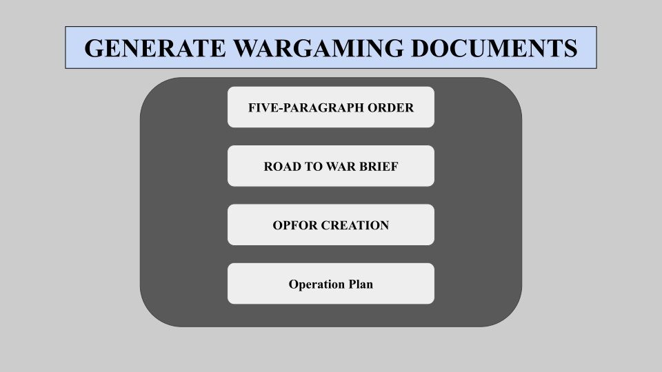
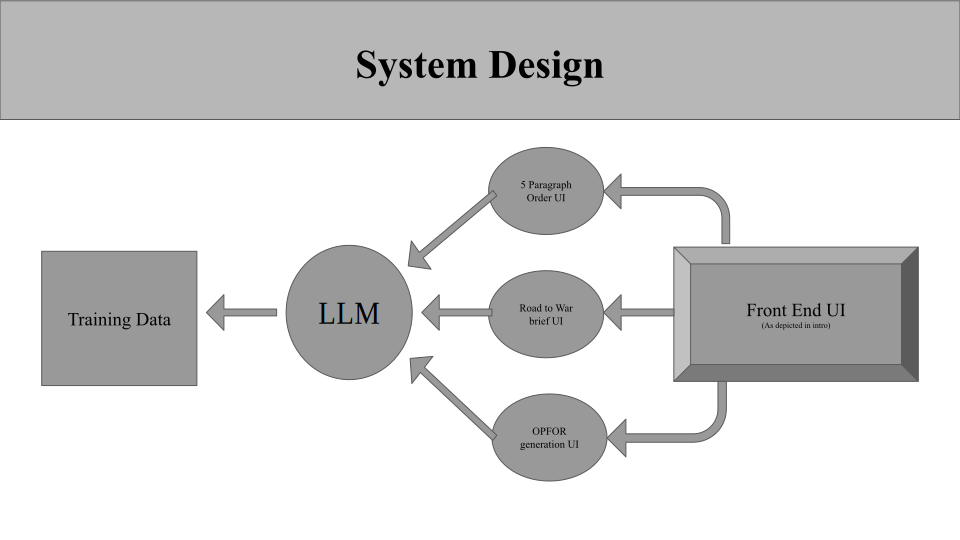

# AI in Wargaming Capstone Proposal

MIDN Peter Asjes, Henry Frye, Caleb Koutrakos, Will Robinson, and Robert Ziman

## Capstone Details

Slides: [Capstone Proposal](https://docs.google.com/presentation/d/1ZQm_i69DicPDcvga37xQAQbg_A87fOJkCFcStDvK-CQ/edit?usp=sharing)

Poster: [Capstone Poster](./USNA%20Capstone%20Poster.png)

### What Are We Planning to Build?

Our group is planning to build a group of Language Models (LMs) capable of generating specific and niche documents for wargaming. Wargaming is defined by the *NATO Wargaming Handbook* as "representations of conflict or competition in a safe-to-fail environment, in which people make decisions and respond to the consequences of those decisions." These niche documents for Wargaming are operation orders such as the Five Paragraph Order of the USMC. Other examples could be MOVREPs, OPFOR creation, road to war briefs, and potential responses.

Here is an example of a 5 Paragraph Order that one of the LMs would need to be capable of generating [ExampleOPorder](./ExOPORDER.pdf). Each of these LMs will be capable of creating a document based on user input into the user interface. The user interface as depicted below will allow a user to select what document they want to create and enter the required information needed to generate the document. 
  

Our product is not designed to be implemented in a specific wargame scenario or under a particular set of rules. This product is designed to be applicable to most scenarios by generating artifacts that are commonly used in wargames that are independent of the scenario rules or can easily be included in the prompt.

### What Problem Will It Solve?

Wargaming in its current state requires artifacts that need to be manually created, taking up valuable time and energy that could be better spent on the more critical aspects of the wargame. Our product would allow users to provide
basic input about their needs and save valuable time creating their scenarios.

### Why is it important?

Current publicly available AI and language models do not have the ability to create documents to the required authenticity and quality standards required for a wargame. Many currently available services are not familiar with the format that the various artifacts are required to be in. Furthermore, publicly available closed-source models are not able to be used on classified networks as required for some DoD applications.

In addition, our capstone project fits into a larger vision, the *Naval Wargaming Modernization Initiative*. This initiative is part of a five year plan, and our capstone fits into their FY25 plan for the initial development of the initiative's capabilities. Our capstone and the initialize at large help increase our ability to address increasingly complex modern scenarios, compete with the PRC, and begin the long road to meaningful AI integration in wargaming.

## Market Research/Lit Review

### What is wargaming?

Joint Publicayion 1 defines a wargame as "A simulation, by whatever means, of a military operation involving two or more opposing forces, using rules, data, and procedures designed to depict an actual or assumed real life situation." Wargaming has long been a tool used in military planning, training, and preparation for real combat scenarios using simulated scenarios to improve decision making of everyone involved. In the past, wargames had to be conducted manually with only human players making the decisions for both sides using their previous experiences. As early as 2015 the call to innovate wargaming came from the Deputy Secretary of the Navy. Unfortunately, that call while acknowledged and looked into did not see almost any progress. (Robert Work, Former Deputy SECNAV) General Berger was another high ranking member of the DOD who called for advancement in wargaming and M&S during his time as Commandant of the Marine Corps. (Scotty Black, LtCol. USMC PhD) In recent years, the calls for AI in wargaming to be explored in more detail have grown and many in the DOD want to see progress.

### What is an LLM?

A large language model is defined by IBM as "A category of foundation models trained on immense amounts of data making them capable of understanding and generating natural language and other types of content to perform a wide range of tasks." The goal of our capstone is to develop smaller language models that can produce natural and correct documentation for use in wargames. Our language models will be trained on large amounts of wargame artifacts and be able to produce unique artifacts that follow the same structure.   

### Current State of the People's Republic of China (PRC)

The importance of AI in wargaming is highlighted by the PLA's use of the technology to train their military. China has not had a lot of combat experience in the modern battlefield and has turned to wargaming to ensure their military is capable of quick decision making to out manuever the enemy. With the U.S. military getting farther away from any near peer combat experience and the changing of the modern battlefield, we are losing our advantage. In order to stay ahead, we need to push our officers and enlisted into situations where they must improve their decision-making and capability to adapt to changing situations.

### Current State of AI in wargaming for U.S. and allies

"Consensus on the current state of play was consistent: ‘AI for wargaming is in its infancy’, there is ‘not much going on’ in this space, 11 and ‘AI is not really used at this stage.’" (Alan Turing Institute, AI in Wargaming) As the paper goes on to say there are many in the military community that are hesitant to believe that AI will be able to produce results worth the time and research

### Goal of incorporating AI in wargaming

The Naval Wargaming Modernization Initiative aims to transform military wargaming through the research, development, and integration of cutting-edge technologies in modeling and simulation (M&S) and artificial intelligence (AI), enhancing strategic decision-making, operational planning, and Joint multi-domain interoperability to be better postured to address the emerging complexities of modern and future conflicts. (Scotty Black, LtCol. USMC PhD)

### State of other publicly available LLMs

ChatGPT and other LLMs are large and capable, however they have limitations when applied to DoD projects:

First, open source LLM are not optimized for wargames and cannot provide specific and trustworthy artifacts. Most LLMs were not build with military expertise in mind which can cause the accuracy of their product to be compromised. The level at which publicly available LLMs are at in wargaming generation is promising, but they are missing the training data and are built as a jack of all trades, not with a specific purpose in mind.

Second, publicly available LLMs do not and will not have access to confidential or secret DoD information. There is a need for LLMs internal to the DoD that allow for sensitive information to be processed and produced for Wargaming Commands and beyond. With LLMs secured as an open source and private to the DoD, we could eventually train the LLMs created by our team with classified data.

### AI and reinforced learning

### What is a USMC Five Paragraph Order?

The USMC five paragraph order is a standardized format consisting of the situation, mission, execution, administration and logistics, and command and signal. Each topic is its on paragraph or information resulting in it being a five paragraph order. This is a standard employed to effectively communicate military operations to subordinates. These five paragraph orders are generated at each level of command from the top down to small unit commanders getting more specific with each level down.

### What is a road to war brief?

A road to war brief is a made up scenario describing how the build-up of tensions two or more nations is leading to war and potentially includes the breaking point. The brief describes what political rhetoric exists, the strength of each nation involved, border issues, the internal state of involved nations, how diplomacy has failed leading to war, and more.

### What is a MOVREP?

A Movement Report (MOVREP) is a formatted message that tells where the ship is going, its speed, the waypoints it will follow, the times, and expected stops. The MOVREP is submitted when certain criteria is met.

### What is OPFOR Generation?

### Sources

1. [NATO Wargaming Handbook](https://paxsims.wordpress.com/wp-content/uploads/2023/09/nato-wargaming-handbook-202309.pdf)

2. [AI in Wargaming](https://cetas.turing.ac.uk/publications/artificial-intelligence-wargaming)

3. [Scaling Artificial Intelligence for Digital Wargaming in Support of Decision-Making](https://arxiv.org/pdf/2402.06075)

4. [Memorandum on wargaming by Deputy SECDEF](https://paxsims.wordpress.com/wp-content/uploads/2015/04/osd-memowargaming-innovationdepsecdefworkfeb15.pdf)

## How Does This Improve Wargames?

Current Process:

- A question/problem needs to be examined in a wargame
- Artifacts for this wargame are put together by hand. This requires a large amount of manpower, especially with finding artifacts to use that fit the scenario or creating original artifacts to fit the scenario
- Scenarios are influenced by the one putting together the wargaming documents and may not present the randomness or different way of thinking of our enemy.

Process After Our Product is Implemented

- A question/problem needs to be examined in a wargame
- Generative AI produces artifacts for wargaming through some user input, significantly speeding up the process of wargame development and complexity
- Prove that there is a future for AI in wargames for the DoD

## Proposed Design and Architecture

### How are we going to build this?

1. We will begin by building one small language model (LM) centered around creating 5 paragraph orders to get an idea of how to train a language model with reinforced learning.
2. We will train this specific LM on available 5 paragraph orders acquired from Marines on the yard with access to many of them. The LM will use retrieval-augmented generation (RAG) for training to increase the accuracy of the output generated.
3. We will build a front end using PHP and html so a website is able to be accessed to interact with the LM. (We may explore better alternatives if needed)
4. Once we have a single working LM and user interface we can begin exploring other wargaming documents.
5. We will train our LMs on data collected from our customer and other sources, on and off of the Yard. This training data will be put into a database that we will build, so each specific LM can pull the specific data it needs to produce an accurate output of the artifact it is generating.
6. We will build several smaller, more specifically trained language models that produce a particular artifact.
7. We will improve the front end to our customers preferences that provides a coherent interface between a user and the LMs

This will require:

1. Data to train each LM
2. The necessary systems to host the interface

## Project Management

### Product Backlog

1. Gather source documents to train LM. Will require reaching out to community members who have access (3/5)
2. Build programs to read in source documents based on document type (typed vs scanned in). These programs exist already and should be easy to find and implement (1/5)
3. Build first LM. The group has varying levels of experience constructing LMs (5/5)
4. Build a UI for interface for future users. The group has limited skills regarding UI on different platforms (3/5)
5. Build remaining LMs. This task should get easier after constructing the first one and locating source documents/training material (3/5)

### Preliminary Release Plan

- Create a way to properly parse documents to use them as training data for our models (NOV 26)
- Gather documents needed to train LM on a USMC 5 paragraph order (DEC 10)
- Create our first LM that can create a USMC 5 paragraph order as a proof of concept (JAN 20)
- Create a front end with a GUI that can take user input and return the output from our LM (FEB 3)
- Create a second LM that generates another common artifact using in wargames (FEB 17)
- Link second LM to our front end (FEB 17)
- Continue to create more LMs for specific artifacts and link to the front end (MARCH 1 - APRIL 30)

### User Stories

- As a user, I can generate a 5 paragraph order that is accurate enough to be used in a wargame.
- As a user, I can generate a Road to War Brief.
- As a user, I can generate a MOVREP.
- As a user, I can generate an accurate OPFOR to go up against in a wargame.
- As a user, I can edit the output from the program to better fit the needs of the wargame.

### SMEs

#### Dr. Chambers

In our initial meeting with Professor Chambers, our team received important feedback. Professor Chambers is a subject matter expert on Generative AI. He encouraged us to punctuate why our product will be more useful that publicly available Artificial Intelligence.

#### LT Gentile

LT Gentile is designated as a subject matter expert on Wargames. He pointed out that wargames are an incredibly broad field and he encouraged our group to solidify the specific artifacts our customer would like to see produced.

### Resources

Training Data for LMs

- Op Orders
- MOVREPs
- Road to War
- INTEL reports
- Message traffic
- Congressional Archives

## Admin/Fine Print

### Customer Meeting Requirements/Plans

- Try to meet with sponsor bi-weekly to update him on our progress
- Have our sponsor test our software after each new usable development
- Find experts in wargaming around USNA to test each development stage of our software

### How Code Will Be Delivered

All code will be uploaded onto our public [GitHub Repository](https://github.com/PJusna/AI_Wargaming_Capstone)

### Licensing

Paragraph 10 of the USNA CS Capstone Instruction:

The software developed as part of the capstone course becomes property of the DoD. The Computer Science Department does not assume any responsibility for maintaining the software produced for any customer of the capstone
project. The customer may use the software within the context of their USNA affiliation, and may not distribute it without approval from the USNA legal office.
