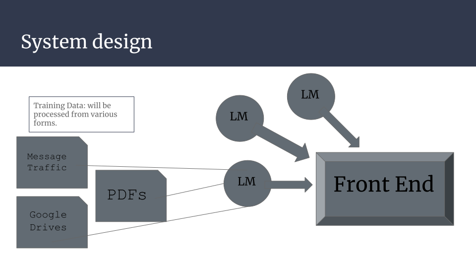

# AI in Wargaming Capstone Proposal

MIDN Peter Asjes, Henry Frye, Caleb Koutrakos, Will Robinson, and Robert Ziman

## Capstone Details

Slides: [Capstone Proposal](https://docs.google.com/presentation/d/1ZQm_i69DicPDcvga37xQAQbg_A87fOJkCFcStDvK-CQ/edit?usp=sharing)

Poster: [Capstone Poster](./USNA%20Capstone%20Poster.png)

### What Are We Planning to Build?

Our group is planning to build a group of Language Models (LMs) capable of generating specific and niche documents for Wargaming. Wargaming is defined by the <u>NATO Wargaming Handbook</u> as "representations of conflict or competition in a safe-tofail environment, in which people make decisions and respond to the
consequences of those decisions." These niche documents for Wargaming are operation orders such as the Five Paragraph Order of the USMC. Other examples could be MOVREPs, OPFOR creation, road to war briefs, and potential responses. Here is an example of a 5 Paragraph Order that one of the LMs would need to be capable of generating [ExampleOPorder](./ExOPORDER.pdf). Each of these LMs will be capable of creating a document based on user input into the user interface. The user interface as depicted below will allow a user to select what document they want to create and enter the required information needed to generate the document.

(Insert Example UI here)

### What Problem Will It Solve?

Wargaming in its current state requires artifacts that need to be manually created, taking up valuable time and energy that could be better spent on the more critical aspects of the wargame. Our product would allow users to provide
basic input about their needs and save valuable time creating their scenarios.

### Why is it important?

Current publicly available AI and language models do not have the ability to create documents to the required authenticity and quality standards required for a wargame. Many currently available services are not familiar with
the format that the various artifacts are required to be in. Furthermore, publicly available closed-source models are not able to be used on classified networks as required for some DoD applications.

## Market Research/Lit Review

The Naval Wargaming Modernization Initiative aims to transform military wargaming through the research, development, and integration of cutting-edge technologies in modeling and simulation (M&S) and artificial intelligence (AI), enhancing strategic decision-making, operational planning, and Joint multi-domain interoperability to be better postured to address the emerging complexities of modern and future conflicts. (Scotty Black, PhD)

ChatCPT and other LLMs are large and capable, however they have limitations when applied to DoD projects:

First, open source LLM are not optimized for wargames and cannot provide specific and trustworthy artifacts. Most LLMs were not build with military expertise in mind which can cause the accuracy of their product to be compromised.

Second, publicly available LMs do not and will not have access to confidential or secret DoD information. There is a need for LMs internal to the DoD that allow for sensitive information to be processed and produced for Wargaming Commands and beyond.

## How Does This Improve Wargames?

Current Process:

- A question/problem needs to be examined in a wargame
- Artifacts for this wargame are put together by hand. This requires a large amount of manpower, especially with finding artifacts to use that fit the scenario or creating original artifacts to fit the scenario

Process After Our Product is Implemented

- A question/problem needs to be examined in a wargame
- Generative AI produces artifacts for wargaming through some user input, significantly speeding up the process of wargame development and complexity

## Proposed Design and Architecture

### How are we going to build this?

1. We will build several smaller, more specifically trained language models that produce a particular artifact
2. We will train our LMs on data collected from our customer and other sources, on and off of the Yard
3. We are going to build a front end to our customers preferences that provides a coherent interface between a user and the LMs

This will require:

1. Data to train the LMs
2. The necessary systems to host the interface

### System Design

## Project Management

### Preliminary Release Plan

- Create a way to properly parse documents to use them as training data for our models
- Create our first LM that can create a USMC 5 paragraph order as a proof of concept
- Create a front end with a GUI that can take user input and return the output from our LM
- Create a second LM that generates another common artifact using in wargames
- Link second LM to our front end
- Continue to create more LMs for specific artifacts and link to the front end

### User Stories

- As a user, I can generate an artifact that is accurate enough to be used in a wargame
- As a user, I can edit the output from te program to better ft the needs of the wargame

### Product Backlog

1. Gather source documents to train LM. Will require reaching out to community members who have access (3/5)
2. Build programs to read in source documents based on document type (typed vs scanned in). These programs exist already and should be easy to find and implement (1/5)
3. Build first LM. The group has varying levels of experience constructing LMs (5/5)
4. Build a UI for interface for future users. The group has limited skills regarding UI on different platforms (3/5)
5. Build remaining LMs. This task should get easier after constructing the first one and locating source documents/training material (3/5)

### SMEs

Dr. Chambers

In our initial meeting with Professor Chambers, our team received important feedback. Professor Chambers is a subject matter expert on Generative AI. He encouraged us to punctuate why our product will be more useful that publicly available Artificial Intelligence.

LT Gentile

LT Gentile is designated as a subject matter expert on Wargames. He pointed out that wargames are an incredibly broad field and he encouraged our group to solidify the specific artifacts our customer would like to see produced.

### Resources

Training Data for LMs

- Op Orders
- MOVREPs
- Road to War
- INTEL reports
- Message traffic
- Congressional Archives

## Admin/Fine Print

### Customer Meeting Requirements/Plans

- Try to meet with sponsor bi-weekly to update him on our progress
- Have our sponsor test our software after each new usable development
- Find experts in wargaming around USNA to test each development stage of our software

### How Code Will Be Delivered

All code will be uploaded onto our public [GitHub Repository](https://github.com/PJusna/AI_Wargaming_Capstone)

### Licensing

Paragraph 10 of the USNA CS Capstone Instruction:

The software developed as part of the capstone course becomes property of the DoD. The Computer Science Department does not assume any responsibility for maintaining the software produced for any customer of the capstone
project. The customer may use the software within the context of their USNA affiliation, and may not distribute it without approval from the USNA legal office.
